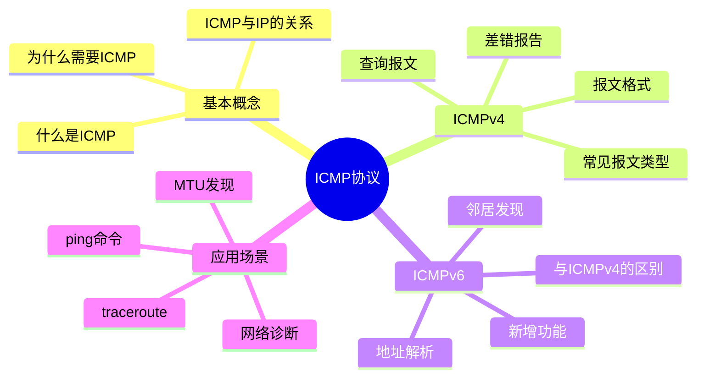
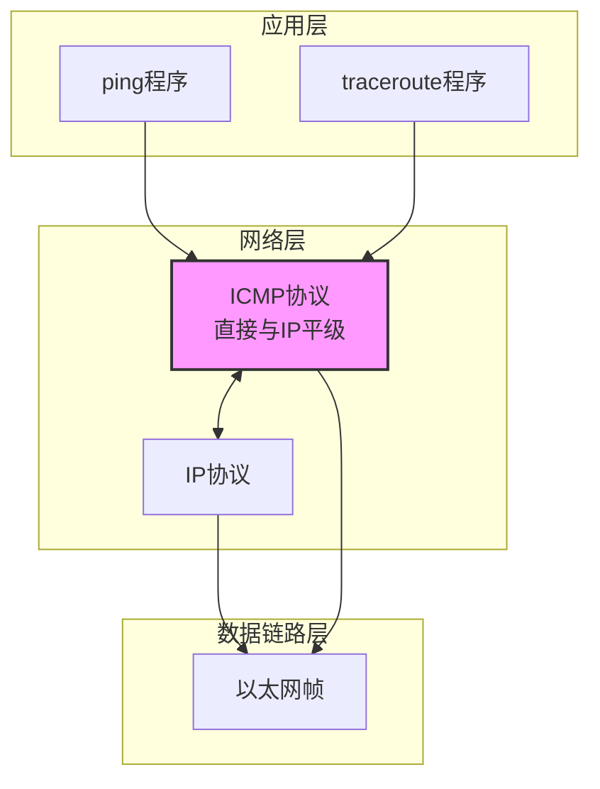
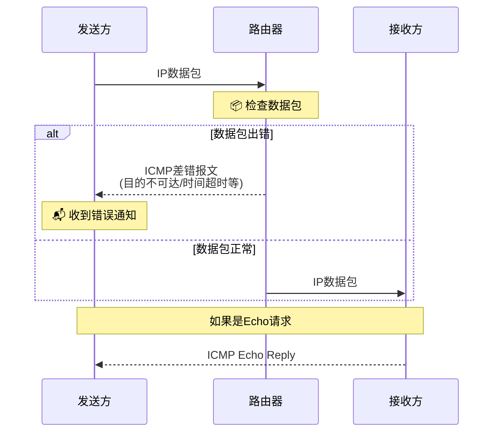
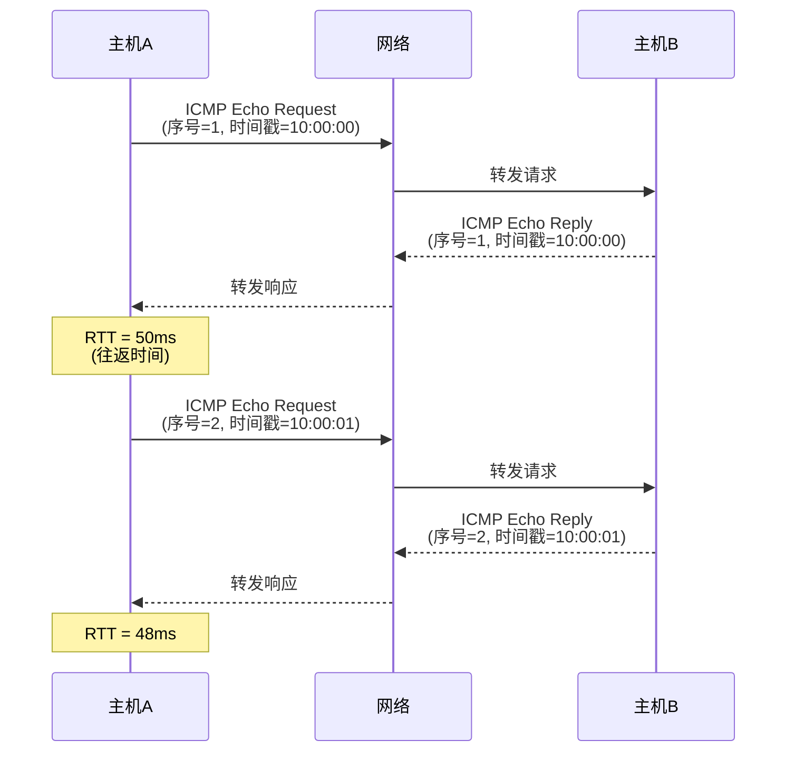
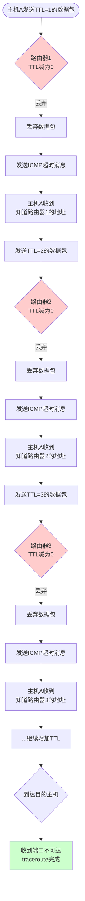

# 精美Markdown文档输出示例

这是一个符合教学级标准的完整学习向导示例,展示了所有格式元素。

---

```markdown
---
title: "ICMP协议 学习向导"
date: "2025-01-04"
description: "从零开始理解互联网控制消息协议,掌握网络诊断的核心技能"
---

# 📘 ICMP协议 - 新手学习向导

> 💡 **欢迎来到网络世界**! ICMP协议就像是网络的"神经系统",它让网络能够"说话"和"反馈"。别被专业术语吓到,我们会用最生活化的比喻,带你一步步理解这个核心协议。

[](https://img.shields.io/badge/难度-中级-yellow)
[](https://img.shields.io/badge/时间-3小时-blue)
[](https://img.shields.io/badge/人群-初学者-green)

## 📑 目录

- [1. 🗺️ 宏观知识全景](#1-宏观知识全景)
- [2. 🧱 核心概念翻译机](#2-核心概念翻译机)
- [3. ⚙️ 技术原理可视化](#3-技术原理可视化)
- [4. 🚶 初学者学习路线](#4-初学者学习路线)
- [5. ⚠️ 避坑指南](#5-避坑指南)
- [6. 📚 延伸学习](#6-延伸学习)

---

## 1. 🗺️ 宏观知识全景



### 知识体系说明

ICMP(Internet Control Message Protocol,互联网控制消息协议)是TCP/IP协议族中的核心成员,但它不像TCP、UDP那样用于传输数据,而是作为IP协议的**助手**,专门负责:
- 📢 **报告错误**: 当数据包无法送达时,通知发送方
- 🔍 **诊断网络**: 提供ping、traceroute等诊断工具的基础
- 📊 **状态查询**: 查询网络节点的工作状态

> 🎯 **核心价值**: 如果IP是"快递公司",ICMP就是"客服部门"——快递送不到时,客服会通知你;你想测试线路时,客服会帮你测试。

---

## 2. 🧱 核心概念翻译机

| 技术术语 | 🗣️ 大白话解释 | 🍎 生活比喻 | 💡 为什么需要它? |
|:---|:---|:---|:---|
| **ICMP** | 互联网控制消息协议 | **网络世界的"快递状态反馈"** | IP只管送快递不管送没送到。ICMP就像快递员打电话告诉你"查无此人"或"收件人不在" |
| **Echo Request/Reply** | 回显请求/响应 | **网络版的"喂喂喂"** | 就像打电话时说"喂喂,听得见吗?"测试网络通不通 |
| **目的不可达** | Destination Unreachable | **快递送不到的通知单** | 就像快递员告诉你"地址错误"或"门锁着",让发送者知道数据包为什么没到 |
| **时间超时** | Time Exceeded | **快递路上耽搁太久了** | 就像快递在路上转圈圈,超过了时限。traceroute命令利用这个来追踪路由 |
| **跳数限制** | Hop Limit/TTL | **快递的转手次数上限** | 为了防止快递在转运站之间无限循环,规定最多转手几次,到了就扔掉 |

### 概念详解

#### 📡 ICMP协议
ICMP是IP层的重要补充协议,工作在网络层(第3层)。它不传输用户数据,只传输**控制消息**和**错误报告**。

**生活化理解**:
- IP协议就像**快递公司**,只管运送包裹
- ICMP就像快递公司的**客服系统**:
  - 包裹丢了 → 客服打电话告诉你(目的不可达)
  - 包裹在路上转圈 → 客服通知你超时(时间超时)
  - 你想测试线路 → 客服帮你发测试包裹(Echo请求)

#### 🔁 Echo Request/Reply
这是ICMP最著名的功能,ping命令就是基于它实现的。

**工作原理**:
1. 主机A发送一个**Echo Request**(回显请求)给主机B
2. 主机B收到后,必须回复一个**Echo Reply**(回显响应)
3. 主机A计算往返时间(RTT, Round-Trip Time)

**类比**:
就像你对着山谷喊一声"喂!",听到回声就说明有路。ping就是网络版的"回声测试"。

#### 🚫 目的不可达(Destination Unreachable)
当路由器无法将数据包送达目的地时,会发送此消息。

**常见原因**:
- 网络不可达(Network Unreachable): 就像"路不通"
- 主机不可达(Host Unreachable): 就像"门牌号错误"
- 端口不可达(Port Unreachable): 就像"收件人不在家"
- 需要分片(Fragmentation Needed): 就像"包裹太大,需要拆分"

---

## 3. ⚙️ 技术原理可视化

### 3.1 ICMP在网络协议栈中的位置



**原理简述**:
ICMP是一个很特别的协议,它**不经过TCP或UDP**,而是直接和IP在网络层平级。你可以把IP看作"快递公司",只管运送包裹;而ICMP是"客服部门",专门处理各种异常情况和状态查询。

> 💡 **关键理解**: ICMP消息本身就是IP数据包的一种,只是它的**数据部分**包含的是ICMP报文,而不是用户数据。

### 3.2 ICMP差错报告流程



**工作流程**:

1. **发送方**发送IP数据包
2. **路由器**检查数据包:
   - 如果出错(地址错误、TTL超时等)→ 丢弃并生成ICMP差错报文
   - 如果正常 → 继续转发
3. **接收方**收到Echo请求时,必须回复Echo Reply

**类比**:
就像你在寄快递:
- ✅ 包裹正常送达 → 收件人签收
- ❌ 包裹送不到 → 快递员给你打电话(发送ICMP消息)
- 📞 你测试线路 → 快递员帮你发个测试包裹并反馈

### 3.3 Ping命令的工作原理



**原理详解**:

1. **发送Echo请求**: 主机A发送ICMP Echo Request,包含:
   - 序号(Sequence Number): 标识第几个请求
   - 时间戳: 记录发送时间

2. **接收Echo响应**: 主机B收到请求后,立即回复Echo Reply

3. **计算往返时间**:
   ```
   RTT = 收到响应的时间 - 发送请求的时间
   ```

**动手实践**:
```bash
# Windows系统
ping www.baidu.com

# Linux/Mac系统
ping -c 4 www.baidu.com
```

你会看到类似这样的输出:
```
正在 Ping www.a.shifen.com [14.215.177.38] 具有 32 字节的数据:
来自 14.215.177.38 的回复: 字节=32 时间=50ms TTL=54
来自 14.215.177.38 的回复: 字节=32 时间=48ms TTL=54
来自 14.215.177.38 的回复: 字节=32 时间=49ms TTL=54
```

### 3.4 Traceroute的工作原理



**原理详解**:

Traceroute巧妙利用了**TTL(Time To Live)**机制:

**TTL是什么?**
- TTL是IP数据包中的"跳数限制",就像包裹的"转运次数上限"
- 每经过一个路由器,TTL减1
- TTL减为0时,数据包被丢弃,并发送ICMP"时间超时"消息

**Traceroute的技巧**:
1. 第一次发送TTL=1的包 → 路由器1收到后TTL=0 → 超时并回复
2. 第二次发送TTL=2的包 → 能到达路由器2 → 路由器2超时并回复
3. 第三次发送TTL=3的包 → 能到达路由器3 → 路由器3超时并回复
4. ...依次增加TTL,直到到达目的地

**类比**:
就像你要追踪包裹经过了哪些转运站:
- 第一次: 允许转1次 → 转运站1退回 → 知道转运站1的位置
- 第二次: 允许转2次 → 到达转运站2后退回 → 知道转运站2的位置
- 以此类推,直到送达目的地

**动手实践**:
```bash
# Windows系统
tracert www.baidu.com

# Linux/Mac系统
traceroute www.baidu.com
```

---

## 4. 🚶 初学者学习路线

### 📖 第一阶段 [入门] - 理解"它是什么"

**⏱️ 预计时间**: 1小时

**🎯 学习目标**:
- [ ] 理解ICMP的基本概念和作用
- [ ] 知道ICMP与IP的关系
- [ ] 熟悉常见的ICMP消息类型
- [ ] 能够使用ping命令测试网络连通性

**📝 重点内容**:
1. **ICMP是什么**
   - ICMP = 互联网控制消息协议
   - 工作在网络层,与IP平级
   - 不传输用户数据,只传输控制消息

2. **为什么需要ICMP**
   - IP协议本身没有错误报告机制
   - ICMP为IP提供了"反馈能力"
   - 是网络诊断和故障排查的基础

3. **常见ICMP消息类型**
   - Echo Request/Reply (ping)
   - 目的不可达
   - 时间超时
   - 重定向
   - 源抑制

**💡 阅读建议**:
> 先看文档第1-2章,了解ICMP的设计背景和基本原理。重点理解ICMP报文格式,但**不要死抠每个字段的含义**。知道Type是报文类型、Code是子类型就足够了。

**🎮 动手实践**:
```bash
# 测试网络连通性
ping www.baidu.com

# 测试本地网络
ping 127.0.0.1

# 查看ping帮助
ping /?
```

**✅ 阶段检查**:
- [ ] 能用自己的话解释ICMP是什么
- [ ] 能熟练使用ping命令
- [ ] 知道ping的工作原理

---

### 🔍 第二阶段 [理解] - 搞懂"它怎么跑"

**⏱️ 预计时间**: 2小时

**🎯 学习目标**:
- [ ] 理解ICMP差错报告的各种情况
- [ ] 搞清楚ping和traceroute的工作原理
- [ ] 理解ICMPv6相比ICMPv4的变化
- [ ] 能用ICMP进行基本网络故障诊断

**📝 重点内容**:

1. **ICMP差错报告**
   - 目的不可达的各种情况
   - 时间超时的机制
   - 重定向的作用
   - 源抑制(流量控制)

2. **ICMP查询报文**
   - Echo Request/Reply
   - Timestamp Request/Reply
   - Address Mask Request/Reply

3. **ICMPv6的新功能**
   - 整合了ARP功能
   - 邻居发现协议(NDP)
   - 路径MTU发现

**💡 阅读建议**:
> 第3-5章详细介绍各种ICMP报文类型,这是核心内容。**仔细看Echo、目的不可达、时间超时这三种**,其他可以快速浏览。

**🎮 动手实践**:

1. **用Wireshark抓包分析ICMP**:
   ```bash
   # 安装Wireshark(免费开源)
   # 1. 启动Wireshark
   # 2. 选择网络接口
   # 3. 输入过滤条件: icmp
   # 4. 执行ping命令
   # 5. 观察抓到的ICMP报文
   ```

2. **使用traceroute追踪路由**:
   ```bash
   # Windows
   tracert www.baidu.com

   # Linux/Mac
   traceroute www.baidu.com

   # 观察每一跳的路由器地址和延迟
   ```

3. **ICMP报文结构实验**:
   ```bash
   # 发送不同大小的ping包
   ping -l 1000 www.baidu.com  # Windows
   ping -s 1000 www.baidu.com  # Linux

   # 观察分片情况
   ```

**✅ 阶段检查**:
- [ ] 能解释ping和traceroute的工作原理
- [ ] 能看懂ICMP报文的基本结构
- [ ] 能用ICMP工具诊断网络问题

---

### 🚀 第三阶段 [深入] - 钻研"底层细节"

**⏱️ 预计时间**: 4小时+ (可选,适合进阶)

**🎯 学习目标**:
- [ ] 深入理解ICMPv6的邻居发现协议
- [ ] 掌握路径MTU发现的机制
- [ ] 了解ICMP的安全问题
- [ ] 能够设计复杂的网络诊断方案

**📝 重点内容**:

1. **ICMPv6邻居发现协议(NDP)**
   - 路由器发现(Router Discovery)
   - 前缀发现(Prefix Discovery)
   - 参数发现(Parameter Discovery)
   - 地址解析(Address Resolution)
   - 邻居不可达检测(Neighbor Unreachability Detection)
   - 重复地址检测(Duplicate Address Detection)
   - 重定向(Redirect)

2. **路径MTU发现**
   - MTU的概念
   - DF位(Don't Fragment)
   - 分片与重组
   - PMTUD(Path MTU Discovery)

3. **ICMP安全问题**
   - ICMP洪水攻击(ICMP Flood)
   - Smurf攻击
   - Ping of Death
   - ICMP隧道
   - 防护措施

**💡 阅读建议**:
> 第6-8章讲ICMPv6的新功能和高级主题,内容比较复杂。**如果你不做网络运维或安全相关的工作,这部分可以略过**。等前面的都理解了,再来看这些高级主题。

**⚠️ 注意**:
> 这些高级主题涉及很多网络协议的底层细节,需要扎实的网络基础。如果你感到吃力,不要着急,先回去巩固前面的知识。

**✅ 阶段检查**:
- [ ] 理解ICMPv6的NDP协议
- [ ] 掌握路径MTU发现的原理
- [ ] 了解ICMP相关的安全风险
- [ ] 能设计网络诊断方案

---

## 5. ⚠️ 避坑指南

> ⚠️ **注意**: 以下是初学者容易踩的坑,务必仔细阅读!这些都是前人用血泪换来的经验。

### 1. 🚫 不要试图背诵所有ICMP报文类型

**❌ 错误做法**:
- 死记硬背ICMP的几十种报文类型(Type 0 - Type 40+)
- 强行记住每个字段的含义和取值范围

**✅ 正确做法**:
- 记住**常用的5-6种**就够了: Echo、目的不可达、时间超时、重定向、源抑制
- 其他的查RFC文档就行,不用背

**💡 为什么**:
ICMP有几十种报文类型,实际工作中常用的就那么几种。就像你不用记住所有快递单的类型,只需要知道"普通快递"、"加急"、"拒收"这几种就够了。

---

### 2. 🚫 不要混淆ICMP和传输层协议

**❌ 错误做法**:
- 认为ICMP是TCP或UDP的上层协议
- 试图为ICMP分配端口号

**✅ 正确做法**:
- ICMP在网络层(第3层),与IP平级
- ICMP不提供端口号,不负责端到端的可靠传输
- 它是IP的"配套服务",不是独立的传输协议

**💡 为什么**:
ICMP消息本身就是IP数据包的一种,只是数据部分包含的是ICMP报文。就像快递单本身就是快递的一种,只是上面写的不是收件人信息,而是"包裹无法送达"的通知。

---

### 3. 🚫 跳过ICMPv6的邻居发现协议(初学者)

**❌ 错误做法**:
- 第一次学习就试图深入理解ICMPv6的NDP
- 在ARP、NDP、Router Discovery等概念中迷失

**✅ 正确做法**:
- 先知道"ICMPv6把ARP的功能整合进来了"就行了
- 等理解了IPv4的ARP、RARP等协议,再看NDP会清晰很多

**💡 为什么**:
NDP(邻居发现协议)非常复杂,涉及地址解析、路由器发现、前缀发现等多个子协议,一口气吃不成胖子。

---

### 4. 🚫 不要在生产环境测试ICMP攻击

**❌ 错误做法**:
- 在公司网络测试Smurf攻击
- 对别人的服务器进行ICMP洪水攻击

**✅ 正确做法**:
- 只在自己的测试环境中实验
- 或者使用虚拟机、网络模拟器

**💡 为什么**:
这些ICMP攻击会严重影响网络性能,甚至造成服务拒绝。**测试攻击方法是违法的**,除非你有明确的授权。

---

### 5. 🚫 不要只看书,一定要动手实验

**❌ 错误做法**:
- 只看文档和教材
- 不实际操作ping、traceroute等工具
- 不抓包分析ICMP报文

**✅ 正确做法**:
- 边看边动手,每个命令都亲自敲一遍
- 用Wireshark抓包,亲眼看看ICMP报文长什么样
- 遇到问题就实验,用事实验证理解

**💡 为什么**:
ICMP协议看书很抽象,但抓包一看就懂了。**亲眼看到的ICMP消息,比读100页书都管用**。

---

### 6. 🚫 注意防火墙可能屏蔽ICMP

**❌ 错误做法**:
- ping不通就认为网络不通
- 不考虑防火墙规则

**✅ 正确做法**:
- ping不通时,先检查是否被防火墙屏蔽
- 尝试其他诊断工具(telnet、curl等)
- 检查防火墙日志

**💡 为什么**:
很多服务器为了安全,**屏蔽了所有ICMP消息**。ping不通不代表网络不通,可能只是对方不想理你而已。

---

## 6. 📚 延伸学习

### 📖 推荐资源

**经典书籍**:
- 📚 《TCP/IP详解 卷1:协议》- W.Richard Stevens
- 📚 《计算机网络:自顶向下方法》- James F.Kurose
- 📚 《图解TCP/IP》- 井口信和

**在线文档**:
- 📄 [RFC 792 - ICMPv4](https://tools.ietf.org/html/rfc792)
- 📄 [RFC 4443 - ICMPv6](https://tools.ietf.org/html/rfc4443)
- 📄 [RFC 1191 - Path MTU Discovery](https://tools.ietf.org/html/rfc1191)

**视频教程**:
- 🎥 [Wireshark抓包实战 - ICMP分析](https://www.youtube.com/results?search_query=wireshark+icmp)
- 🎥 [计算机网络 - ICMP协议(中文字幕)](https://www.bilibili.com/video/BV1xx411c7mD)

**实用工具**:
- 💻 **Wireshark**: 免费开源的网络协议分析工具
- 💻 **Nmap**: 网络扫描和发现工具
- 💻 **Fping**: 批量ping工具
- 💻 **MTR**: 结合ping和traceroute的诊断工具

---

### 🎯 实践项目

**项目1: 网络连通性诊断脚本**
```bash
#!/bin/bash
# 编写一个脚本,自动诊断网络问题
# 1. ping本地网关
# 2. ping DNS服务器
# 3. traceroute目标地址
# 4. 输出诊断报告
```

**项目2: ICMP报文分析器**
```python
# 使用Scapy库编写一个ICMP报文分析器
# 1. 捕获ICMP报文
# 2. 解析报文类型和代码
# 3. 统计各类ICMP消息的数量
# 4. 生成可视化报告
```

**项目3: 网络拓扑发现工具**
```bash
# 使用traceroute和ICMP发现网络拓扑
# 1. 向多个目标发送traceroute
# 2. 绘制网络拓扑图
# 3. 标记关键节点和延迟
```

---

### 📝 练习题

1. **基础题**:
   - [ ] 为什么ICMP不提供端口号?
   - [ ] ping命令使用的是哪两个ICMP报文类型?
   - [ ] TTL超时时,哪个设备发送ICMP超时消息?

2. **进阶题**:
   - [ ] Traceroute是如何利用TTL机制追踪路由的?
   - [ ] ICMPv6相比ICMPv4有哪些主要改进?
   - [ ] 路径MTU发现的原理是什么?

3. **实战题**:
   - [ ] 使用Wireshark抓包,分析一次ping过程的完整ICMP交互
   - [ ] 编写一个脚本,检测网络中哪些主机屏蔽了ICMP
   - [ ] 使用traceroute分析到www.google.com的路由路径

---

## 💪 最后的鼓励

恭喜你走到这里! 🎉

ICMP协议看起来很抽象,但其实是网络协议中最"人性化"的一个——它就像网络的**反馈机制**,让冰冷的网络能够"说话",告诉你哪里出问题了。

理解了ICMP,你就掌握了**网络诊断的神器**:
- 🔧 `ping` → 测试网络通不通
- 🔧 `traceroute` → 找出网络故障点
- 🔧 ICMP消息 → 理解网络发生了什么

**如果你觉得头晕,这完全正常!**
- 网络协议本身就是抽象的
- 多抓几次包,多用几次工具
- 慢慢地,你就能"感知"到ICMP消息在网络中流动的过程了

**记住**:
- ✅ 不要着急,一步一步来
- ✅ 动手实践比看书更重要
- ✅ 遇到问题就实验,用事实说话

**继续加油!** 💪

当你能用ping和traceroute这两个神器解决90%的网络连通性问题时,你会发现,原来网络世界也没那么神秘!

---

## 📝 文档信息

- 📅 **生成时间**: 2025-01-04
- 🎯 **适用人群**: 编程初学者、网络入门者、运维新手
- ⏱️ **预计学习时间**: 3-7小时(根据深度)
- 📧 **反馈**: 如果有任何问题或建议,欢迎反馈!
- 📄 **版本**: v1.0

---

**🎓 学习清单**:
- [ ] 第一阶段:理解ICMP是什么
- [ ] 第二阶段:搞懂ICMP怎么跑
- [ ] 第三阶段:钻研ICMP底层细节(可选)
- [ ] 完成所有动手实践
- [ ] 完成3个练习题

**祝你学习愉快!** 🚀
```
