# Mermaid 可视化指南

这个文件提供如何使用 Mermaid 绘制各种技术图表的指南和最佳实践。

## 为什么使用可视化

初学者在阅读技术文档时,最大的困难是:
1. **概念抽象** - 无法在大脑中构建具体形象
2. **关系复杂** - 不知道各个组件如何协作
3. **流程难追踪** - 数据如何流转、执行顺序是什么

可视化图表能帮助初学者:
- 快速建立整体认知
- 理解组件间的关系
- 追踪数据流和执行流

## Mermaid 图表类型选择

### 1. Mindmap (思维导图) - 用于宏观知识全景

**适用场景**: 展示整体架构、知识体系、章节关系

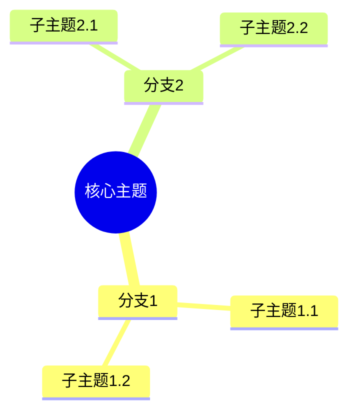

**示例**: Web开发知识体系
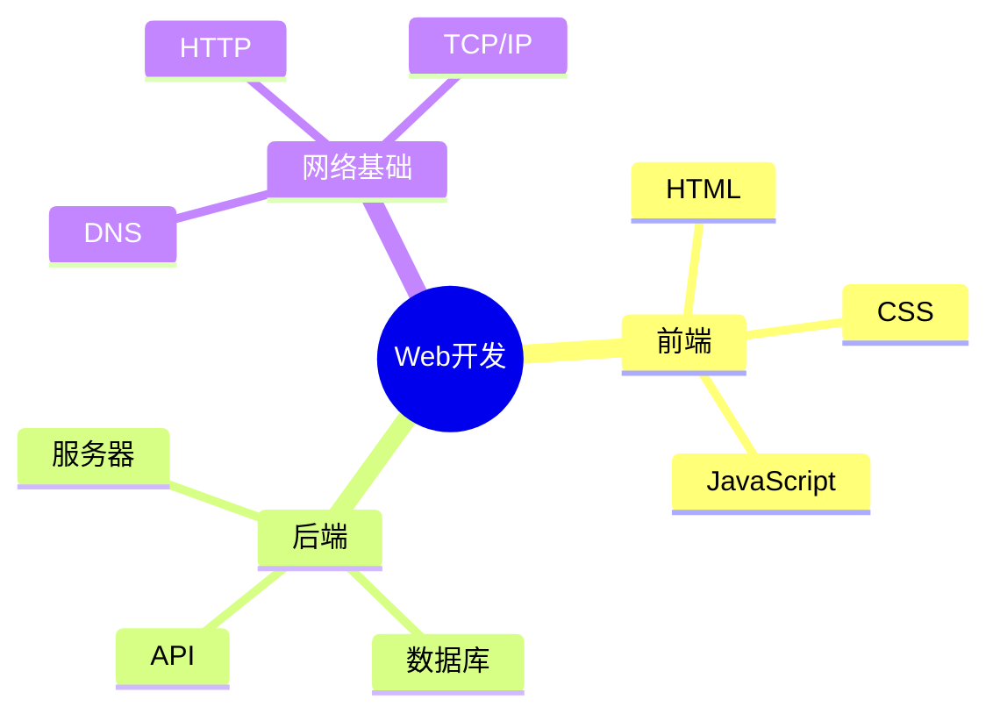

**设计原则**:
- 层次不要超过4层,否则过于复杂
- 每个节点不超过6个字
- 主题数量控制在4-7个(符合人类短期记忆容量)

---

### 2. Flowchart (流程图) - 用于展示执行流程

**适用场景**: 算法流程、请求处理流程、决策树

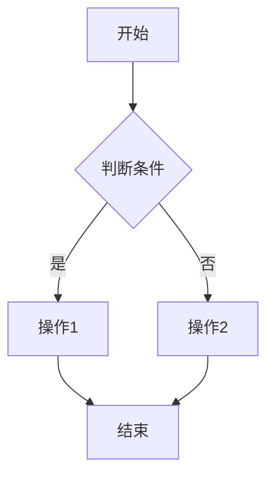

**示例**: 用户登录流程
```mermaid
flowchart TD
    A[用户提交登录表单] --> B{验证格式}
    B -->|格式错误| C[返回错误提示]
    B -->|格式正确| D[查询数据库]
    D -->|用户不存在| E[返回"用户不存在"]
    D -->|用户存在| F{验证密码}
    F -->|密码错误| G[返回"密码错误"]
    F -->|密码正确| H[生成Session]
    H --> I[跳转到首页]
```

**方向说明**:
- `TD`: Top Down (从上到下)
- `LR`: Left Right (从左到右)

**设计原则**:
- 每个节点用方框 `[]` 或圆角矩形 `[]`
- 判断用菱形 `{}`
- 箭头上的文字用 `|文字|` 标注
- 流程从左到右或从上到下,不要交叉

---

### 3. Sequence Diagram (时序图) - 用于展示交互过程

**适用场景**: API调用、函数调用、消息传递

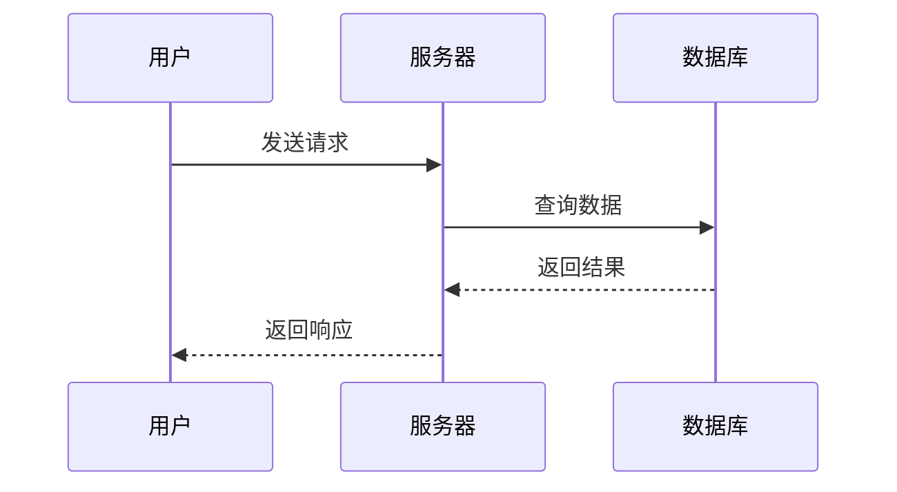

**箭头类型**:
- `->>`: 实线箭头(同步请求)
- `-->>`: 虚线箭头(返回响应)
- `->`: 不带箭头的实线
- `-->`: 不带箭头的虚线

**示例**: HTTP请求处理
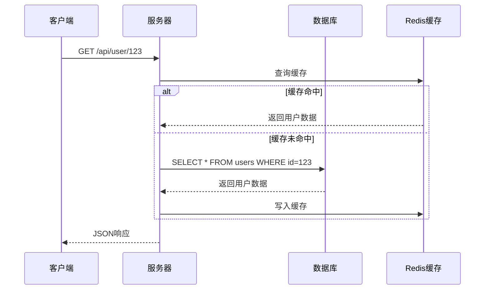

**设计原则**:
- 参与者从左到右按调用顺序排列
- 每个消息用简单文字描述,避免技术细节
- 用 `alt/else` 块展示条件分支
- 消息总数不要超过15个,否则太长

---

### 4. State Diagram (状态图) - 用于展示状态转换

**适用场景**: 订单状态、线程状态、生命周期

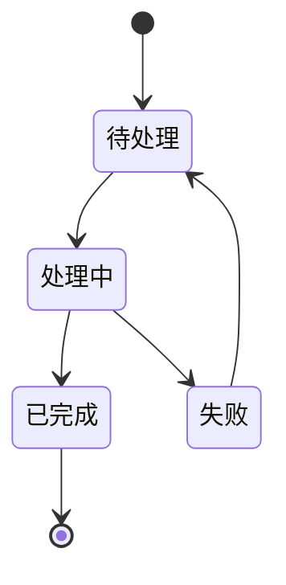

**示例**: 订单状态流转
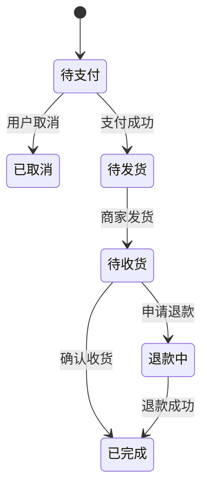

**设计原则**:
- 用简单的名词表示状态
- 箭头上标注触发条件
- 避免超过8个状态

---

### 5. Graph (关系图) - 用于展示组件关系

**适用场景**: 系统架构、模块依赖、数据流向

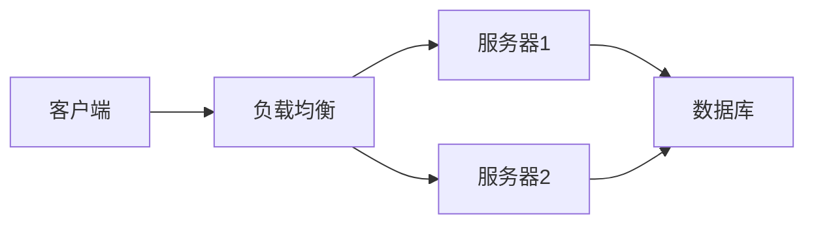

**示例**: 三层架构
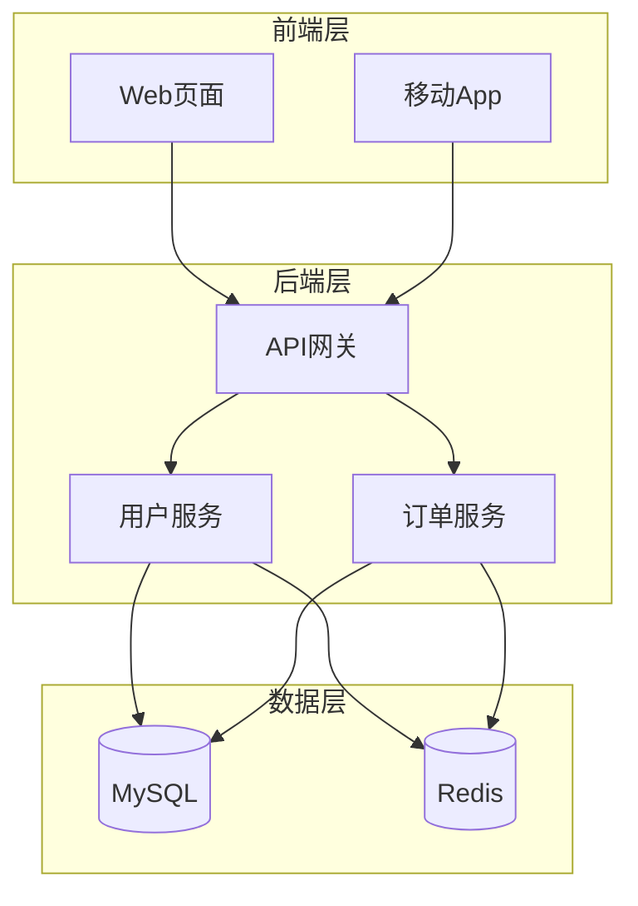

**设计原则**:
- 用 `subgraph` 组织相关组件
- 数据库用圆柱体 `[(名称)]`
- 按照数据流向排列(从左到右或从上到下)
- 关系清晰,避免交叉线太多

---

### 6. Class Diagram (类图) - 用于展示类结构

**适用场景**: 面向对象设计、数据模型

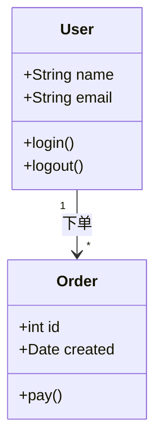

**符号说明**:
- `+`: public (公开)
- `-`: private (私有)
- `#`: protected (受保护)
- `"1" --> "*"`: 一对多关系

**示例**: 电商数据模型
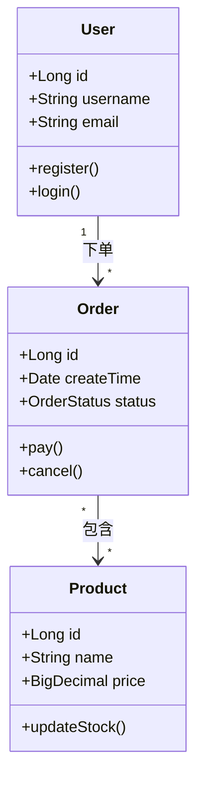

---

## 设计最佳实践

### 1. 简洁性原则
- **控制规模**: 单个图不要超过20个节点
- **避免嵌套**: 超过3层的嵌套很难看懂
- **留白**: 节点之间不要挤在一起

### 2. 可读性原则
- **统一命名**: 使用一致的术语风格(全部中文或全部英文)
- **简短标签**: 节点文字不超过10个字
- **颜色区分**: Mermaid支持颜色,可以用颜色区分不同类型的节点

### 3. 渐进式展示
对于复杂系统,分多个图表展示:
1. **高层架构图**: 展示主要组件
2. **详细流程图**: 针对关键流程展开
3. **数据流图**: 专门展示数据流转

### 4. 初学者友好设计
- **避免专业术语**: 用"用户"代替"Principal",用"服务器"代替"Backend"
- **添加说明**: 图表下方用简短文字配合解释
- **场景化**: 用具体场景代替抽象概念(例如用"点外卖"代替"异步调用")

---

## 常见问题与解决方案

### Q1: 图表太复杂怎么办?
**A**: 拆分成多个图表:
- 先画一个宏观架构图
- 再针对每个模块画详细流程图
- 用"详见下图"引导读者

### Q2: Mermaid 渲染失败怎么办?
**A**: 检查常见错误:
- 冒号后面必须有空格
- 节点名称不要用特殊字符
- 箭头方向要正确 (`-->` 不是 `-- >`)

### Q3: 如何让图表更直观?
**A**: 使用图标和颜色:
- 用表情符号: `📊[(数据库)]`
- 用颜色: `classDef style fill:#f9f,stroke:#333`

### Q4: 如何展示时间顺序?
**A**:
- 时序图最适合展示时间顺序
- 流程图的箭头方向也暗示了顺序
- 可以用数字标注: `1.登录` `2.查询` `3.返回`

---

## 模板库

### 模板1: 技术章节全景图
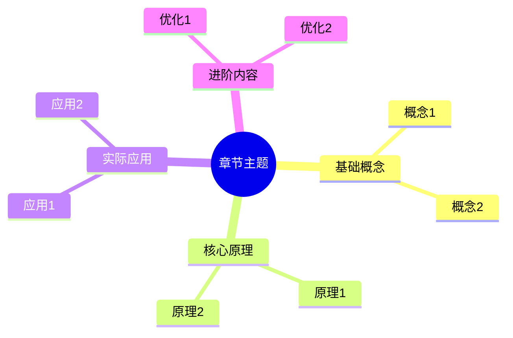

### 模板2: 技术流程图
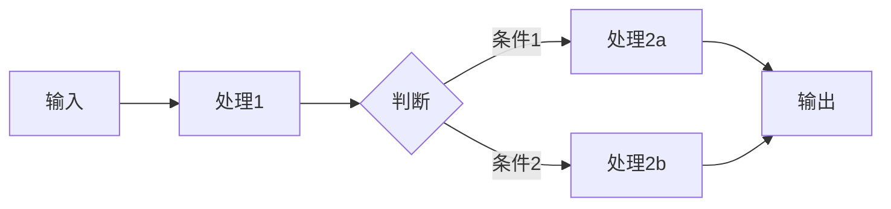

### 模板3: 系统交互图
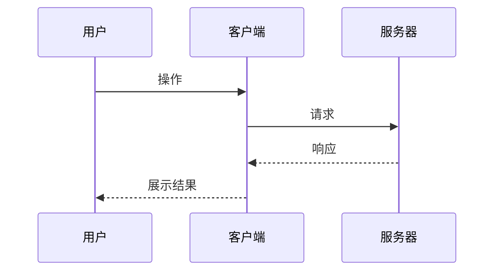

---

## 学习资源

- **Mermaid 官方文档**: https://mermaid.js.org/
- **在线编辑器**: https://mermaid.live/
- **语法速查**: 在SKILL.md中保持常用的3-5种图表类型即可

---

**记住**: 图表的目的是帮助理解,不是为了炫技。简单、清晰、易懂的图表比复杂华丽的图表更有价值。
